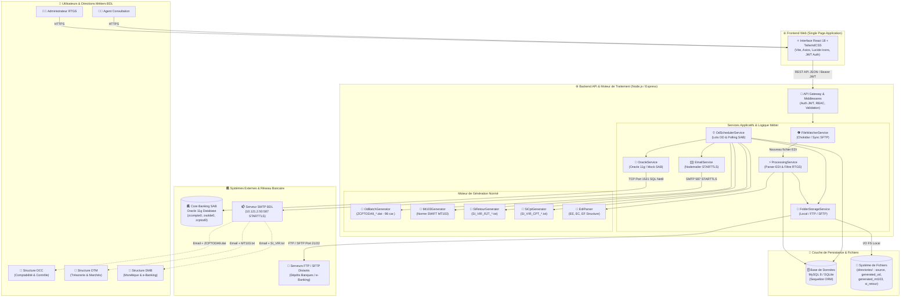
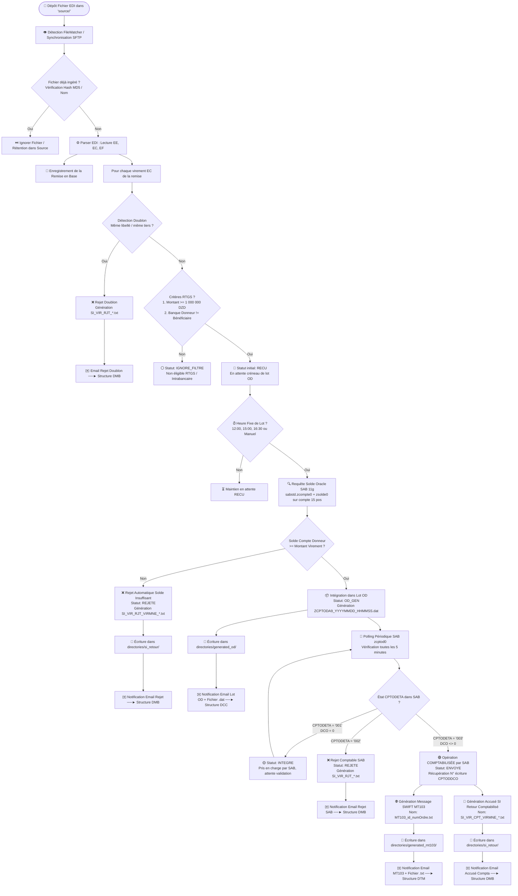
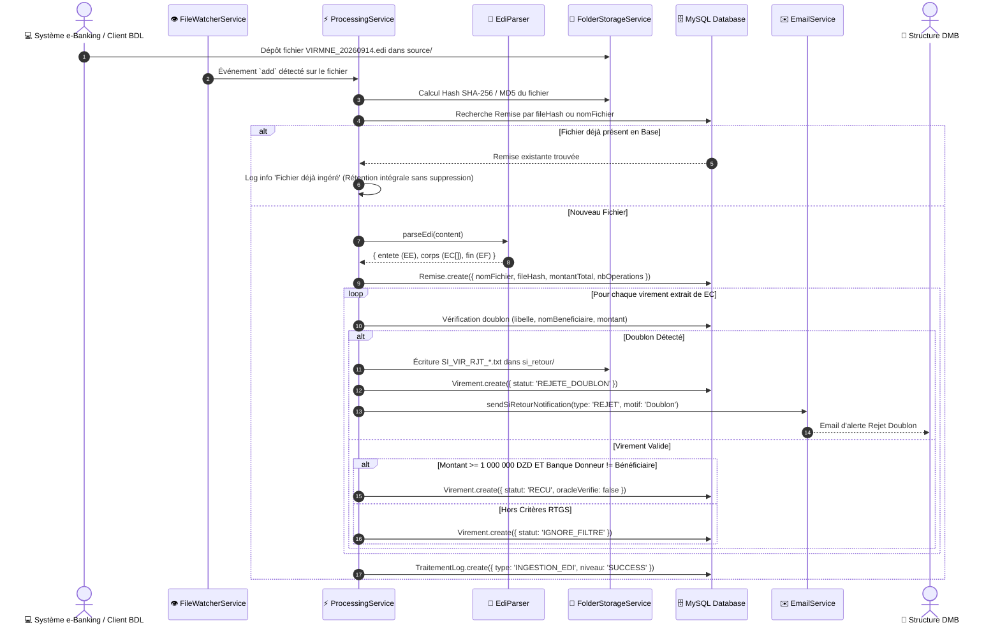
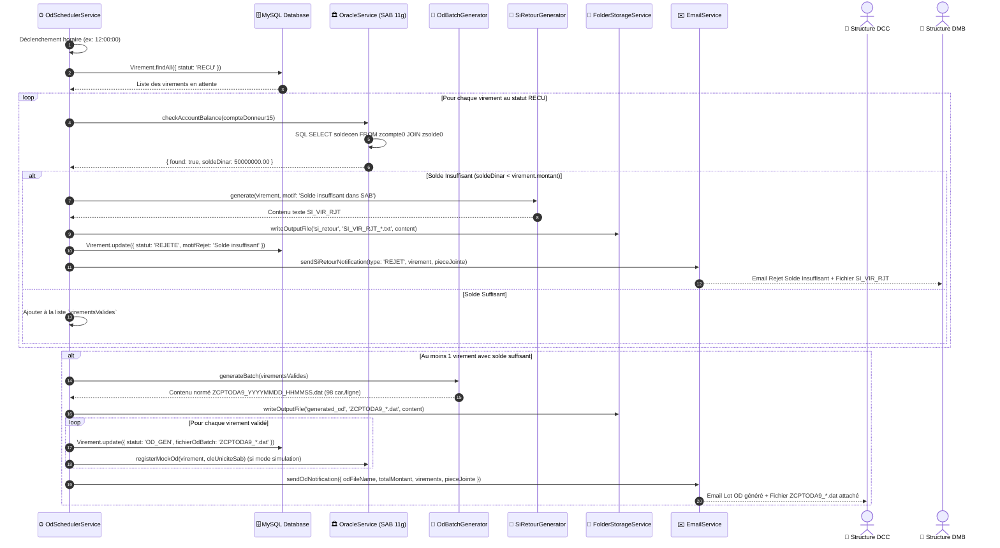
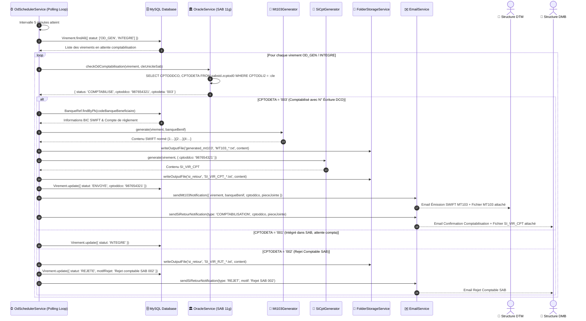
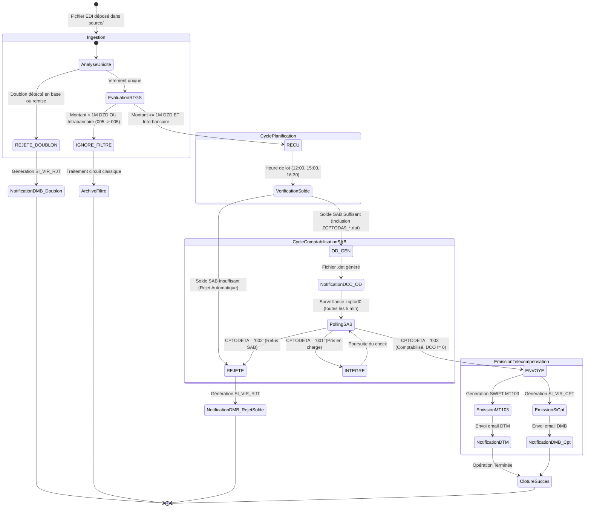
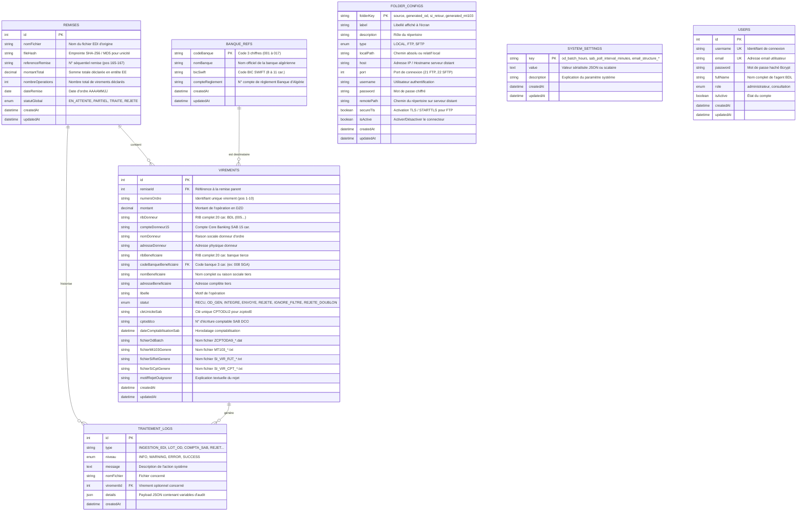
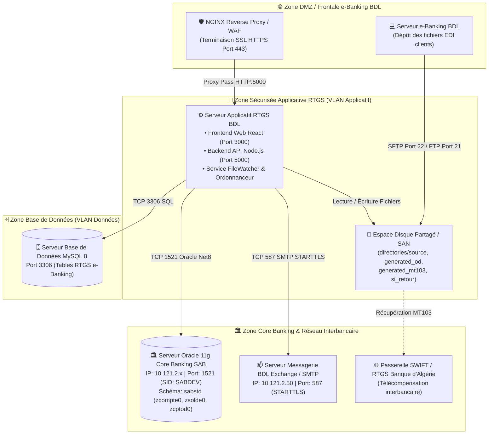

# 🏗️ GUIDE TECHNIQUE D'ARCHITECTURE & DIAGRAMMES
## Plateforme BDL RTGS E-Banking — Moteur EDI, Ordonnancement OD & Télécompensation SWIFT MT103

---

## 📑 Sommaire
1. [Vue d'Ensemble & Architecture Globale du Système](#1-vue-densemble--architecture-globale-du-système)
2. [Diagramme d'Architecture Applicative (C4 Container Level)](#2-diagramme-darchitecture-applicative-c4-container-level)
3. [Diagramme de Flux Global End-to-End (Data Flow Diagram)](#3-diagramme-de-flux-global-end-to-end-data-flow-diagram)
4. [Diagrammes de Séquence Détaillés](#4-diagrammes-de-séquence-détaillés)
   - [Phase 1 : Ingestion EDI, Filtrage & Rétention Source](#phase-1--ingestion-edi-filtrage--rétention-source)
   - [Phase 2 : Ordonnancement des Lots OD & Contrôle Solde SAB](#phase-2--ordonnancement-des-lots-od--contrôle-solde-sab)
   - [Phase 3 : Polling SAB, Émission SWIFT MT103 & Accusés SI](#phase-3--polling-sab-émission-swift-mt103--accusés-si)
5. [Diagramme de la Machine à États des Virements (State Machine)](#5-diagramme-de-la-machine-à-états-des-virements-state-machine)
6. [Diagramme Entité-Relation & Schéma de Base de Données (ERD)](#6-diagramme-entité-relation--schéma-de-base-de-données-erd)
7. [Diagramme des Composants & Modules Backend](#7-diagramme-des-composants--modules-backend)
8. [Diagramme de Déploiement Réseau & Sécurité](#8-diagramme-de-déploiement-réseau--sécurité)
9. [Matrice des Flux, Protocoles & Spécifications d'Interfaces](#9-matrice-des-flux-protocoles--spécifications-dinterfaces)

---

## 1. Vue d'Ensemble & Architecture Globale du Système

La plateforme **BDL RTGS E-Banking** est une solution distribuée, temps réel et hautement résiliente, conçue pour automatiser le traitement des remises de virements bancaires de masse émanant de la plateforme e-Banking de la **Banque de Développement Local (BDL)**.

Elle remplit trois missions critiques :
1. **Acquisition & Filtrage Sécurisé** des fichiers de remises clients (EDI) via surveillance continue de répertoires (Local / FTP / SFTP).
2. **Ordonnancement Périodique des Débits (OD)** avec contrôle de provision direct sur le Core Banking **SAB (Oracle 11g)** et rejet automatique en cas d'insuffisance de solde.
3. **Télécompensation RTGS & Télétransmissions Métiers** vers les directions centrales BDL (**DCC**, **DTM**, **DMB**) par génération de messages normés SWIFT MT103, de fichiers comptables OD et d'alertes emails automatisées avec pièces jointes.

---

## 2. Diagramme d'Architecture Applicative (C4 Container Level)

Ce diagramme illustre les conteneurs applicatifs internes, les bases de données et les interactions avec les systèmes tiers (Core Banking SAB, Serveur SMTP BDL, Serveurs SFTP/FTP distants et Postes Utilisateurs).

---

## 3. Diagramme de Flux Global End-to-End (Data Flow Diagram)

Ce diagramme décrit l'acheminement complet d'un virement, depuis le dépôt initial de la remise client jusqu'à l'émission du SWIFT MT103 et des accusés de traitement.

---

## 4. Diagrammes de Séquence Détaillés

### Phase 1 : Ingestion EDI, Filtrage & Rétention Source

Ce diagramme détaille comment un fichier EDI déposé dans le dossier `source/` est détecté, analysé, validé pour l'unicité et persisté en base de données sans suppression du fichier physique.

---

### Phase 2 : Ordonnancement des Lots OD & Contrôle Solde SAB

Ce diagramme illustre le déclenchement de l'ordonnanceur aux heures programmées (12:00, 15:00, 16:30), l'interrogation synchrone du solde sur le Core Banking SAB, le rejet automatique en cas de défaut de provision et la génération du lot OD global.

---

### Phase 3 : Polling SAB, Émission SWIFT MT103 & Accusés SI

Ce diagramme détaille la surveillance périodique de la table `sabstd.zcptod0` par polling toutes les 5 minutes et les actions consécutives à la comptabilisation définitive.

---

## 5. Diagramme de la Machine à États des Virements (State Machine)

Ce diagramme d'état illustre l'ensemble des statuts possibles d'un virement, les conditions de transition et les états terminaux.

---

## 6. Diagramme Entité-Relation & Schéma de Base de Données (ERD)

Ce diagramme représente la modélisation relationnelle des données dans MySQL / Sequelize.

---

## 7. Diagramme des Composants & Modules Backend

Ce diagramme montre l'organisation modulaire du code source backend (`backend/src/`).

```mermaid
graph LR
    subgraph RoutesLayer ["Routes Express (`src/routes/`)"]
        AuthRoute["authRoutes.js<br/>(Login, Reset, Profile)"]
        VirementRoute["virementRoutes.js<br/>(Listing, Détail, Export)"]
        RemiseRoute["remiseRoutes.js<br/>(Remises, Stats)"]
        SystemRoute["systemRoutes.js<br/>(Schedule, Folders, Banques, SAB)"]
        LogRoute["logRoutes.js<br/>(Logs d'audit & Traitement)"]
    end

    subgraph ServiceLayer ["Services Métiers (`src/services/`)"]
        ProcServ["processingService.js<br/>• Traitement EDI complet<br/>• Recalcul statut remises"]
        SchedServ["odSchedulerService.js<br/>• Lots OD heures fixes<br/>• Polling SAB zcptod0<br/>• Timer Check"]
        WatchServ["fileWatcherService.js<br/>• Surveillance Chokidar<br/>• Déclenchement parsing"]
        StoreServ["folderStorageService.js<br/>• Connecteurs Local/FTP/SFTP<br/>• Écriture/Lecture sécurisée"]
        MailServ["emailService.js<br/>• Nodemailer STARTTLS<br/>• Notifications DCC/DTM/DMB"]
    end

    subgraph ConfigLayer ["Connecteurs & Config (`src/config/`)"]
        OracleConf["oracle.js<br/>• Mode ORACLE_PROD (node-oracledb)<br/>• Mode SIMULATION (Mock SAB)"]
        FolderConf["folders.js<br/>• Chemins répertoires"]
        DBConf["database.js<br/>• Sequelize Pool MySQL/SQLite"]
    end

    subgraph EngineLayer ["Générateurs & Parseurs (`src/generators/` & `src/parsers/`)"]
        EdiParserClass["ediParser.js<br/>• Découpage positions EE, EC, EF"]
        OdBatchGenClass["odBatchGenerator.js<br/>• Format 98 car. BDL & Clés"]
        Mt103GenClass["mt103Generator.js<br/>• SWIFT MT103 :20: à :72:"]
        SiRetGenClass["siRetourGenerator.js<br/>• Format SI_VIR_RJT"]
        SiCptGenClass["siCptGenerator.js<br/>• Format SI_VIR_CPT"]
    end

    RoutesLayer --> ServiceLayer
    ServiceLayer --> EngineLayer
    ServiceLayer --> ConfigLayer
```

---

## 8. Diagramme de Déploiement Réseau & Sécurité

Ce schéma illustre le cloisonnement réseau de la BDL (DMZ, Zone Applicative Interne, Zone Base de Données et Réseau Monétique).

---

## 9. Matrice des Flux, Protocoles & Spécifications d'Interfaces

| N° | Flux / Interface | Source | Destination | Protocole | Fréquence / Déclencheur | Format / Norme |
| :--- | :--- | :--- | :--- | :--- | :--- | :--- |
| **1** | **Ingestion Remise EDI** | e-Banking / Entreprise | `directories/source/` | FS Local / SFTP / FTP | Temps réel (Watcher) / Polling régulier | Fichier texte structuré largeur fixe (`EE`, `EC`, `EF`). |
| **2** | **Vérification Provision** | Backend RTGS (`oracle.js`) | Oracle 11g SAB (`sabstd`) | TCP 1521 (Oracle SQL Net8) | Aux heures fixes de lot (`12:00`, `15:00`, `16:30`) | Requête SQL `SELECT` sur `zcompte0` et `zsolde0`. |
| **3** | **Production Lot OD** | Backend RTGS (`odBatchGen`) | `directories/generated_od/` | I/O FS Local / SFTP / FTP | Aux heures de lot (si solde $\ge$ montant) | Fichier `ZCPTODA9_*.dat` (Format 98 positions normé BDL). |
| **4** | **Notification Email OD** | Backend RTGS (`emailService`) | Structure **DCC** | SMTP 587 (STARTTLS) | À chaque génération de lot OD | Email HTML Corporate BDL + Fichier `.dat` en pièce jointe. |
| **5** | **Surveillance SAB** | Backend RTGS (`odScheduler`) | Oracle 11g SAB (`zcptod0`) | TCP 1521 (Oracle SQL Net8) | Toutes les 5 minutes (paramétrable) | Requête SQL `SELECT` avec clé `CPTODLI2`. |
| **6** | **Émission SWIFT MT103** | Backend RTGS (`mt103Gen`) | `directories/generated_mt103/`| I/O FS Local / SFTP / FTP | Dès confirmation SAB (`CPTODETA = '003'`) | Fichier texte normé SWIFT MT103 standard interbancaire. |
| **7** | **Notification Email MT103**| Backend RTGS (`emailService`) | Structure **DTM** | SMTP 587 (STARTTLS) | Dès comptabilisation SAB (`CPTODETA = '003'`) | Email HTML Corporate BDL + Fichier `MT103_*.txt` en pièce jointe. |
| **8** | **Production SI Retour RJT**| Backend RTGS (`siRetourGen`) | `directories/si_retour/` | I/O FS Local / SFTP / FTP | Lors de rejet (solde, doublon ou SAB) | Fichier `SI_VIR_RJT_*.txt` normé BDL. |
| **9** | **Production SI Retour CPT**| Backend RTGS (`siCptGen`) | `directories/si_retour/` | I/O FS Local / SFTP / FTP | Dès confirmation SAB (`CPTODETA = '003'`) | Fichier `SI_VIR_CPT_*.txt` normé BDL. |
| **10**| **Notification Email SI** | Backend RTGS (`emailService`) | Structure **DMB** | SMTP 587 (STARTTLS) | À chaque rejet ou confirmation de compta | Email HTML Corporate BDL + Fichier `SI_VIR_*.txt` en pièce jointe. |
| **11**| **Supervision Web UI** | Navigateur Utilisateur | API Express Backend | HTTPS / REST JSON (JWT) | À la demande (IHM Web SPA) | Payloads JSON chiffrés, pagination et filtres avancés. |

---
*Document technique d'architecture et de modélisation du système BDL RTGS E-Banking.*
